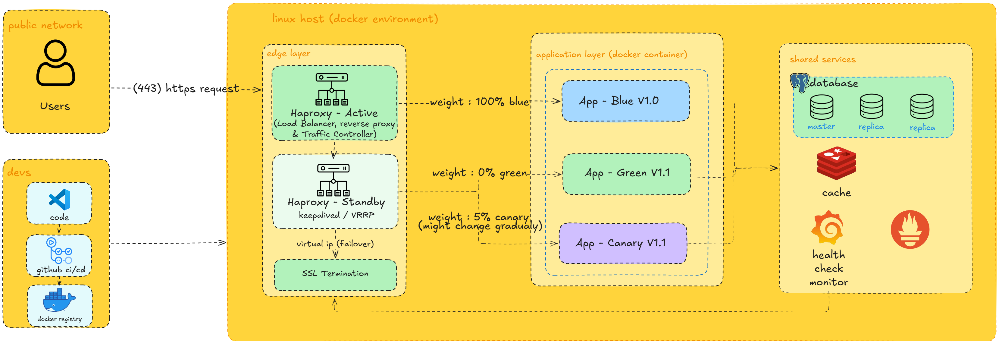

# Mini Self-Hosted PaaS

> **Blue-Green & Canary Deployments** using Linux, Docker, HAProxy

We implemented a self-hosted Platform-as-a-Service (PaaS) infrastructure that enables zero-downtime deployments with blue-green and canary release strategies.

## 📐 Architecture 



---

## 🗂️ Table of Contents

- [Architecture Overview](#-architecture-overview)
- [Features](#-features)
- [Components](#-components)
- [Traffic Routing](#-traffic-routing)
- [Deployment Strategy](#-deployment-strategy)
- [Prerequisites](#-prerequisites)
- [Getting Started](#-getting-started)
- [Project Structure](#-project-structure)
- [CI/CD Pipeline](#-cicd-pipeline)
- [Configuration](#-configuration)
- [Monitoring & Health Checks](#-monitoring--health-checks)
- [Contributing](#-contributing)

---

## ✨ Features

- 🔵🟢 **Blue-Green Deployment** — zero-downtime production releases
- 🐤 **Canary Releases** — gradual traffic shifting to new versions (e.g. 5% → 100%)
- ⚡ **HAProxy Active-Standby** — high availability via Keepalived/VRRP with virtual IP failover
- 🔒 **SSL Termination** — HTTPS handled at the edge layer
- 🐳 **Fully Dockerized** — all application components run in containers
- 📊 **Health Check Monitor** — automated service health visibility
- 🗄️ **Database HA** — PostgreSQL with master + replicas
- 🔴 **Redis Cache** — shared caching layer across all app versions
- 🔄 **GitHub CI/CD** — automated build, push, and deploy pipeline

---

## 🧩 Components

### Edge Layer

| Component | Role |
|-----------|------|
| **HAProxy Active** | Load balancer, reverse proxy, and traffic controller |
| **HAProxy Standby** | Failover node managed via Keepalived/VRRP |
| **Virtual IP** | Floating IP that moves between active and standby on failure |
| **SSL Termination** | Decrypts HTTPS traffic before forwarding to app layer |

### Application Layer (Docker Containers)

| Container | Version | Traffic Weight |
|-----------|---------|----------------|
| **App Blue** | V1.0 | 100% (stable production) |
| **App Green** | V1.1 | 0% (staged, ready to promote) |
| **App Canary** | V1.1 | ~5% (gradual rollout, adjustable) |

### Shared Services

| Service | Description |
|---------|-------------|
| **PostgreSQL** | Primary database with 1 master + 2 read replicas |
| **Redis** | Shared in-memory cache across all app versions |
| **Health Check Monitor** | Monitors container/service health and triggers alerts |

---

## 🚦 Traffic Routing

HAProxy manages traffic weights between the three app variants:

```
                    ┌──────────────────────┐
                    │     HAProxy Active    │
                    │  (Traffic Controller) │
                    └──────────┬───────────┘
                               │
           ┌───────────────────┼───────────────────┐
           │                   │                   │
    weight: 100%         weight: 0%          weight: ~5%
           ▼                   ▼                   ▼
    ┌─────────────┐    ┌─────────────┐    ┌──────────────┐
    │ App Blue    │    │ App Green   │    │ App Canary   │
    │   V1.0      │    │   V1.1      │    │   V1.1       │
    └─────────────┘    └─────────────┘    └──────────────┘
    (Production)       (Staged/Idle)      (Canary Testing)
```

Traffic weights can be adjusted dynamically via HAProxy's runtime API without restarting.

---

## 🔄 Deployment Strategy

### Blue-Green Deployment

1. **Current State**: Blue (V1.0) serves 100% of traffic; Green is idle
2. **Deploy New Version**: Push V1.1 to Green container via CI/CD
3. **Test Green**: Run smoke tests against Green directly
4. **Flip Traffic**: Update HAProxy weight → Blue: 0%, Green: 100%
5. **Rollback (if needed)**: Instantly revert to Blue: 100%, Green: 0%

### Canary Deployment

1. **Deploy Canary**: V1.1 runs alongside V1.0
2. **Gradual Shift**: Start at 5%, monitor metrics and errors
3. **Increase Weight**: Gradually increase canary traffic (5% → 25% → 50% → 100%)
4. **Promote or Rollback**: Promote to full Blue-Green swap, or revert to 0%

### HAProxy Failover (Keepalived/VRRP)

```
Normal:    [HAProxy Active] ← Virtual IP ← Users
Failover:  [HAProxy Active] ✗  →  [HAProxy Standby] ← Virtual IP ← Users
```

If the active HAProxy goes down, Keepalived automatically moves the virtual IP to the standby node within seconds.

---

## ⚙️ Prerequisites

- Linux host (Ubuntu 22.04+ recommended)
- Docker & Docker Compose
- HAProxy 2.x
- Keepalived
- GitHub account (for CI/CD)
- Domain with DNS pointing to your server's IP

---

## 🚀 Getting Started

### 1. Clone the Repository

```bash
git clone https://github.com/firyal-salsa/shipyard.git
cd shipyard
```

### 2. Configure Environment Variables

