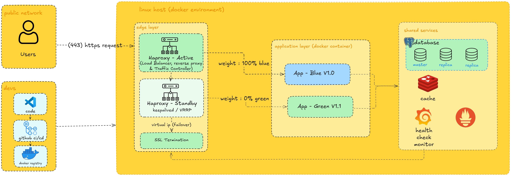
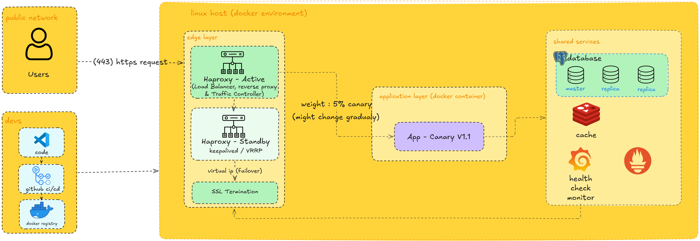

# 🚢 Mini Self-Hosted PaaS

> **Blue-Green & Canary Deployments** using Linux, Docker, HAProxy

We implemented a mini Platform-as-a-Service (PaaS) infrastructure that enables zero-downtime deployments with blue-green and canary release strategies.

---

## 📐 Architecture

The infrastructure runs entirely on a **Linux host with Docker** and is divided into three main layers:

### Blue-Green Architecture


### Canary Architecture



### 1. Edge Layer
- **HAProxy – Active**: acts as a Load Balancer, reverse proxy, and Traffic Controller
- **HAProxy – Standby**: configured with `keepalived / VRRP` for high availability
- **Virtual IP (Failover)**: ensures seamless failover between active and standby HAProxy
- **SSL Termination**: handles HTTPS traffic on port **443**

### 2. Application Layer (Docker Containers)
- **App – Blue (V1.0)**: stable production version
- **App – Green (V1.1)**: new version ready for deployment
- **App – Canary (V1.1)**: limited traffic version for gradual rollout

### 3. Shared Services
- **PostgreSQL Database**: master + 2 replicas for read scalability
- **Redis Cache**: for caching and performance optimization
- **Health Check Monitor**: monitors application and infrastructure health

---

## 🔵🟢 Blue-Green Deployment

Blue-Green deployment allows zero-downtime releases by running two identical environments simultaneously.

```
Users → HAProxy (Active)
             │
             ├── weight: 100% → App Blue  V1.0  ✅ (production)
             │
             └── weight:   0% → App Green V1.1  🕓 (standby)
```

### How It Works
1. **Blue** environment serves 100% of production traffic
2. **Green** environment is deployed with the new version (V1.1)
3. After testing and validation, HAProxy is reconfigured to shift traffic to Green
4. If issues arise, rollback is instant — just switch weight back to Blue

---

## 🐦 Canary Deployment

Canary deployment gradually rolls out a new version to a small subset of users before a full release.

```
Users → HAProxy (Active)
             │
             └── weight: 5% (gradually increasing) → App Canary V1.1 🐦
```

### How It Works
1. Only **5%** of traffic is routed to the Canary version initially
2. Traffic weight is increased gradually based on metrics and health checks
3. If metrics look good, weight increases to 100% (full rollout)
4. If issues are detected, traffic is immediately reduced back to 0%

---

## 🛠 Tech Stack

| Component         | Technology                      |
|-------------------|---------------------------------|
| OS / Host         | Linux                           |
| Containerization  | Docker                          |
| Load Balancer     | HAProxy                         |
| HA / Failover     | Keepalived + VRRP               |
| Database          | PostgreSQL (master + 2 replicas)|
| Cache             | Redis                           |
| CI/CD             | GitHub Actions                  |
| Container Registry| Docker Registry                 |

---